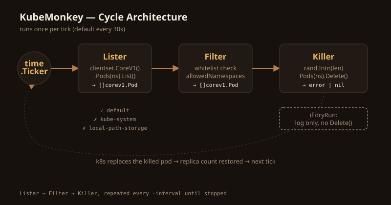

한국어 | [English](./README.md)

# KubeMonkey

Go와 [client-go](https://github.com/kubernetes/client-go)로 만든 Kubernetes용 미니멀 [Chaos Monkey](https://netflix.github.io/chaosmonkey/) 클론입니다. 클러스터에서 랜덤하게 pod을 죽여서, 쿠버네티스가 약속한 대로 워크로드가 실제로 스스로 복구되는지 검증합니다.

## 만든 계기

"replica 5개니까 안전하다"는 건 실제로 장애에서 복구되는 걸 눈으로 보기 전까진 그냥 가정일 뿐입니다. KubeMonkey는 그 복구 과정을 주기적으로 강제로 발생시켜서, 믿는 대신 직접 확인하게 해줍니다.

## 동작 방식

한 사이클마다 세 단계를 거칩니다:

```
Lister  → 클러스터 전체 pod 목록 조회
Filter  → 화이트리스트에 등록된 네임스페이스의 pod만 남김
Killer  → 남은 목록 중 랜덤 하나를 골라 삭제
```

### 설계 결정: 블랙리스트가 아니라 화이트리스트

초기 버전은 `kube-system` 같은 알려진 시스템 네임스페이스를 하나씩 제외하는 방식이었습니다. 이 방식은 새로운 시스템 네임스페이스가 나타나는 순간 조용히 무너집니다 — 실제로 `kind`가 설치하는 `local-path-storage`(이름에 `kube-system`이 없지만 죽이면 똑같이 위험한 컴포넌트)에서 이 문제가 발생했습니다.

그래서 KubeMonkey는 네임스페이스를 명시적으로 허용하는 방식으로 바꿨습니다:

```go
allowedNamespaces := map[string]bool{
    "default": true,
}
```

목록에 없는 건 기본적으로 건드리지 않습니다. 더 안전한 기본값이고, 관리할 것도 줄어듭니다.

## 아키텍처



## 사용법

```bash
go run main.go                          # 30초마다 랜덤 pod 하나 삭제
go run main.go -dry-run                 # 실제로 삭제하지 않고 대상만 로그로 출력
go run main.go -interval=10s -dry-run   # 더 빠른 주기, dry-run 유지
```

플래그:

| 플래그 | 기본값 | 설명 |
|---|---|---|
| `-dry-run` | `false` | 삭제 대신 대상만 로그로 출력 |
| `-interval` | `30s` | 사이클 실행 주기 (Go duration 형식: `10s`, `1m` 등) |

## 로컬 테스트 환경 세팅

```bash
# 로컬 클러스터 띄우기
kind create cluster --name chaos-lab

# KubeMonkey가 테스트할 대상 만들기
kubectl create deployment nginx --image=nginx --replicas=5

# 다른 터미널에서 실시간으로 pod 복구 과정 관찰
kubectl get pods -w
```

## 실행 예시

```
KubeMonkey Activate (dry-run=false, interval=30s)
Killed: default / nginx-69b9cdbbdd-r6w4c
Killed: default / nginx-69b9cdbbdd-8cxvf
Killed: default / nginx-69b9cdbbdd-h4xgc
```

## 스택

- Go
- [client-go](https://github.com/kubernetes/client-go) — 공식 Kubernetes Go 클라이언트
- [kind](https://kind.sigs.k8s.io/) — 개발/테스트용 로컬 클러스터
